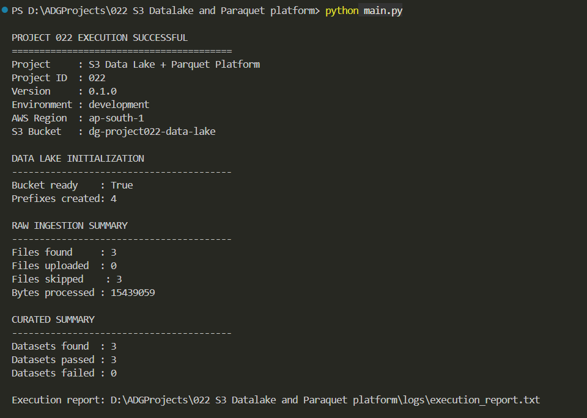
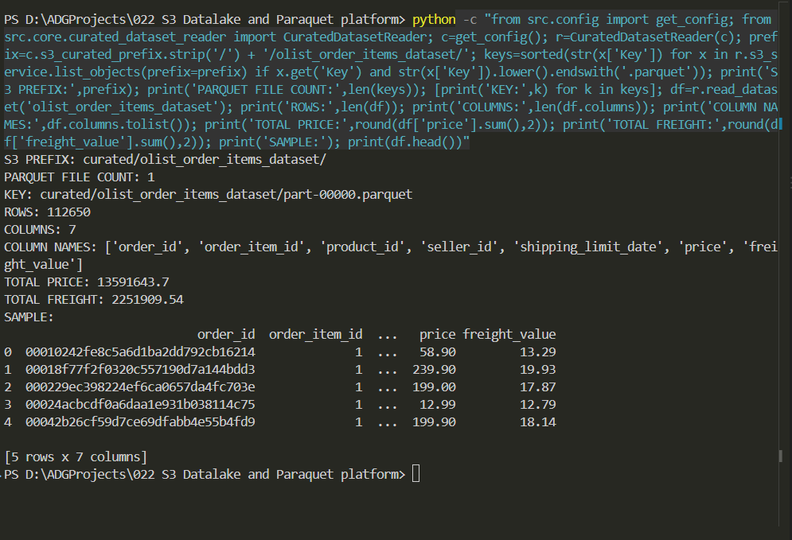
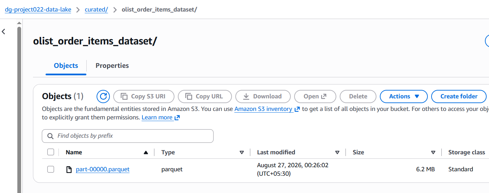
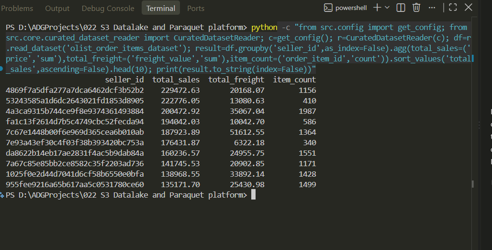

# 2. Project Badges


# 3. Screenshots

| **Screenshot** | **Description** |
| --- | --- |
|  | End-to-end ingestion and curated pipeline execution result. |
|  | Local Parquet output size confirmation. |
|  | Curated Parquet dataset visible in Amazon S3. |
|  | Top-10 seller analysis performed by reading the curated Parquet dataset. |


# 4. Project Title

# S3 Data Lake + Parquet Platform

# 5. Project Overview

Project 022 implements an S3-based data lake workflow for ingesting supported structured datasets, applying dataset definitions and schema validation, converting validated data into Parquet, storing curated datasets in Amazon S3, and providing services for reading, querying, aggregation, profiling, quality validation, metadata, lineage, and reporting.

Typical use cases include:

- Ingesting CSV, JSON, and JSONL datasets.
- Applying predefined dataset schemas and processing rules.
- Converting structured datasets to Parquet.
- Creating partitioned Parquet datasets where configured.
- Storing curated datasets in Amazon S3.
- Reading curated Parquet data for downstream analytics.
- Running dataset quality, metadata, lineage, and execution reporting.

# 6. Features

- S3 data lake initialization.
- Raw dataset ingestion with duplicate/skip handling.
- Dataset-specific source-format validation.
- Dataset definition and schema governance.
- DataFrame-based source loading.
- Schema validation before Parquet generation.
- Non-partitioned Parquet dataset generation.
- Partitioned Parquet dataset generation.
- Parquet validation after generation.
- Curated dataset upload and S3 verification.
- Curated Parquet dataset reading.
- Dataset querying and aggregation.
- Dataset statistics and profiling.
- Dataset metadata and lineage reporting.
- Dataset quality execution and reporting.
- End-to-end execution reporting.

# 7. Technology Stack

| Technology | Purpose |
| --- | --- |
| Python | Application implementation |
| pandas | DataFrame loading and data processing |
| PyArrow / Apache Parquet | Columnar dataset generation, storage, validation, and reading |
| boto3 / Amazon S3 | Data lake storage and S3 integration |
| pytest | Automated testing |
| PyInstaller | Executable build workflow |
| Git / GitHub | Source control and repository management |

# 8. Project Structure

```text
022 S3 Datalake and Paraquet platform/
├── .github/
├── .gitignore
├── .vscode/
├── LICENSE
├── main.py
├── pyproject.toml
├── README.md
├── requirements.txt
├── assets/
│   ├── fonts/
│   ├── icons/
│   ├── images/
│   └── templates/
├── data/
│   ├── curated/
│   ├── curated_test/
│   ├── demo_split/
│   ├── input/
│   ├── output/
│   └── samples/
├── docs/
│   └── UserGuide.md
├── logs/
│   └── execution_report.txt
├── releases/
│   ├── latest/
│   ├── v1.0/
│   └── v1.1/
├── screenshots/
│   ├── generating-top10-sales-using-paraquet-file-reading.PNG
│   ├── ingestion-result-output.PNG
│   ├── paraquet-file-size-confirmation.PNG
│   ├── paraquet-file-visible-in-s3.PNG
│   └── poster.png
├── src/
│   ├── config.py
│   ├── core/
│   │   ├── curated_dataset_aggregation_service.py
│   │   ├── curated_dataset_consumer.py
│   │   ├── curated_dataset_manager.py
│   │   ├── curated_dataset_query_service.py
│   │   ├── curated_dataset_reader.py
│   │   ├── curated_dataset_service.py
│   │   ├── curated_dataset_statistics_service.py
│   │   ├── curated_dataset_validation_service.py
│   │   ├── curated_dataset_validator.py
│   │   ├── curated_data_processor.py
│   │   ├── curated_pipeline.py
│   │   ├── curated_pipeline_runner.py
│   │   ├── dataset_quality_runner.py
│   │   ├── data_lake_manager.py
│   │   ├── parquet_dataset_processor.py
│   │   └── raw_data_ingestor.py
│   ├── dataset_config/
│   │   ├── __init__.py
│   │   └── dataset_definitions.py
│   ├── models/
│   ├── services/
│   │   ├── curated_dataset_metadata_service.py
│   │   ├── curated_dataset_validation_service.py
│   │   ├── curated_pipeline_report_service.py
│   │   ├── dataframe_service.py
│   │   ├── dataset_definition_service.py
│   │   ├── dataset_lineage_service.py
│   │   ├── dataset_quality_execution_report.py
│   │   ├── dataset_quality_orchestrator.py
│   │   ├── dataset_quality_report_service.py
│   │   ├── dataset_quality_service.py
│   │   ├── dataset_schema_registry.py
│   │   ├── execution_report_service.py
│   │   ├── parquet_service.py
│   │   ├── partition_service.py
│   │   ├── s3_service.py
│   │   └── schema_service.py
│   ├── ui/
│   └── utils/
└── tests/
```

# 9. Module Overview

| **Module** | **Responsibility** |
| --- | --- |
| `main.py` | Application entry point and end-to-end execution orchestration. |
| `src/core/` | Core data-lake, ingestion, curated-data, Parquet, pipeline, and quality-processing workflows. |
| `src/services/` | Reusable services for DataFrames, schemas, S3, Parquet, partitions, metadata, lineage, quality, and reporting. |
| `src/dataset_config/` | Dataset definitions and dataset-specific processing rules. |
| `src/config.py` | Application configuration and runtime settings. |
| `tests/` | Slice-level automated tests covering core and service components. |
| `docs/` | User-facing project documentation. |

# 10. Source Code Overview

| **Source File** | **Purpose** | **Dependencies** |
| --- | --- | --- |
| `main.py` | Application entry point. Orchestrates data-lake initialization, ingestion, curated processing, and execution reporting. | `src.config`, core pipeline/manager classes, reporting services |
| `src/config.py` | Defines application configuration, runtime paths, S3 settings, and processing configuration. | Python standard library |
| `src/dataset_config/__init__.py` | Initializes the dataset configuration package. | None |
| `src/dataset_config/dataset_definitions.py` | Defines supported datasets, source formats, expected schemas, and partition configuration. | Python standard library |
| `src/core/data_lake_manager.py` | Initializes and manages the S3 data-lake structure and required prefixes. | `boto3` |
| `src/core/raw_data_ingestor.py` | Discovers supported source files and manages raw-file ingestion into the data lake. | `boto3`, `pathlib` |
| `src/core/curated_pipeline.py` | Executes the curated processing flow from source loading and schema validation through Parquet generation, S3 upload, and verification. | `pandas`, `pyarrow`, internal services |
| `src/core/curated_pipeline_runner.py` | Runs the curated pipeline across discovered datasets and aggregates dataset-level results. | Internal pipeline and reporting services |
| `src/core/curated_data_processor.py` | Coordinates processing of source data into validated curated datasets. | `pandas`, internal dataset/schema services |
| `src/core/parquet_dataset_processor.py` | Generates and validates Parquet datasets, including partitioned datasets. | `pandas`, `pyarrow` |
| `src/core/curated_dataset_manager.py` | Manages curated datasets and their S3 storage operations. | `boto3`, internal S3 service |
| `src/core/curated_dataset_service.py` | Provides higher-level curated-dataset processing operations. | `pandas`, internal services |
| `src/core/curated_dataset_reader.py` | Reads curated Parquet datasets for downstream processing and analysis. | `pandas`, `pyarrow`, internal S3 service |
| `src/core/curated_dataset_query_service.py` | Provides query-oriented operations over curated datasets. | `pandas` |
| `src/core/curated_dataset_aggregation_service.py` | Performs aggregation operations over curated datasets. | `pandas` |
| `src/core/curated_dataset_statistics_service.py` | Calculates dataset statistics and profiling information. | `pandas` |
| `src/core/curated_dataset_validation_service.py` | Coordinates validation of curated dataset outputs. | `pandas`, internal validation services |
| `src/core/curated_dataset_validator.py` | Validates curated dataset contents and processing results. | `pandas`, `pyarrow` |
| `src/core/dataset_quality_runner.py` | Runs dataset quality processing and coordinates quality results. | Internal quality services |
| `src/services/dataframe_service.py` | Loads CSV, JSON, and JSONL files into pandas DataFrames and provides basic DataFrame metadata. | `pandas`, `pathlib` |
| `src/services/schema_service.py` | Validates source DataFrame schemas against expected dataset definitions. | `pandas`, internal dataset configuration |
| `src/services/dataset_definition_service.py` | Provides controlled access to dataset definitions and their validation rules. | Internal dataset configuration |
| `src/services/dataset_schema_registry.py` | Provides schema-registry functionality for configured dataset schemas. | Internal dataset/schema modules |
| `src/services/parquet_service.py` | Provides Parquet generation and validation operations used by curated processing. | `pyarrow`, `pandas` |
| `src/services/partition_service.py` | Handles partition-related dataset processing and partition configuration. | `pandas`, `pyarrow` |
| `src/services/s3_service.py` | Provides S3 storage operations used by the data-lake and curated-data workflows. | `boto3` |
| `src/services/curated_dataset_metadata_service.py` | Produces metadata information for curated datasets. | Internal curated dataset services |
| `src/services/dataset_lineage_service.py` | Provides lineage information connecting source datasets with curated outputs. | Internal dataset services |
| `src/services/curated_dataset_validation_service.py` | Provides service-level validation of curated datasets. | Internal validation modules |
| `src/services/curated_pipeline_report_service.py` | Builds reporting information for curated pipeline execution. | Internal pipeline/result modules |
| `src/services/execution_report_service.py` | Produces the project execution report from pipeline results. | Python standard library, internal reporting modules |
| `src/services/dataset_quality_service.py` | Provides dataset quality evaluation operations. | `pandas`, internal validation modules |
| `src/services/dataset_quality_orchestrator.py` | Coordinates dataset quality checks and their execution flow. | Internal quality services |
| `src/services/dataset_quality_report_service.py` | Produces reports from dataset quality results. | Internal quality/reporting modules |
| `src/services/dataset_quality_execution_report.py` | Represents dataset quality execution results used for reporting. | Python standard library |
| `tests/test_slice2_curated_s3.py` | Tests curated S3 integration behavior from the second implementation slice. | `pytest`, project S3/core modules |
| `tests/test_slice2_execution_reporting.py` | Tests execution reporting behavior from slice 2. | `pytest`, project reporting modules |
| `tests/test_slice2_parquet.py` | Tests Parquet processing behavior from slice 2. | `pytest`, `pyarrow`, project Parquet modules |
| `tests/test_slice2_pipeline_runner.py` | Tests curated pipeline runner behavior from slice 2. | `pytest`, project pipeline modules |
| `tests/test_slice3_curated_dataset_aggregation_service.py` | Tests curated dataset aggregation functionality. | `pytest`, `pandas`, project aggregation service |
| `tests/test_slice3_curated_dataset_consumer.py` | Tests curated dataset consumer functionality. | `pytest`, project consumer modules |
| `tests/test_slice3_curated_dataset_query_service.py` | Tests curated dataset query functionality. | `pytest`, `pandas`, project query service |
| `tests/test_slice3_curated_dataset_reader.py` | Tests reading curated Parquet datasets. | `pytest`, `pandas`, `pyarrow` |
| `tests/test_slice3_curated_dataset_service.py` | Tests curated dataset service behavior. | `pytest`, project curated dataset modules |
| `tests/test_slice3_curated_dataset_statistics_service.py` | Tests dataset statistics and profiling behavior. | `pytest`, `pandas` |
| `tests/test_slice3_curated_dataset_validation.py` | Tests curated dataset validation behavior. | `pytest`, project validation modules |
| `tests/test_slice3_curated_dataset_validator.py` | Tests curated dataset validator behavior. | `pytest`, `pandas`, `pyarrow` |
| `tests/test_slice4_curated_dataset_metadata.py` | Tests curated dataset metadata functionality. | `pytest`, project metadata service |
| `tests/test_slice4_dataset_lineage_service.py` | Tests dataset lineage functionality. | `pytest`, project lineage service |
| `tests/test_slice4_dataset_quality_execution_report.py` | Tests dataset quality execution-report behavior. | `pytest`, project quality reporting modules |
| `tests/test_slice4_dataset_quality_orchestrator.py` | Tests quality orchestration behavior. | `pytest`, project quality services |
| `tests/test_slice4_dataset_quality_report_service.py` | Tests dataset quality report generation. | `pytest`, project quality/reporting modules |
| `tests/test_slice4_dataset_quality_runner.py` | Tests dataset quality runner behavior. | `pytest`, project quality modules |
| `tests/test_slice4_dataset_quality_service.py` | Tests dataset quality service behavior. | `pytest`, project quality modules |
| `tests/test_slice4_dataset_schema_registry.py` | Tests dataset schema registry behavior. | `pytest`, project schema modules |

# 11. How to Run

### 1. Install dependencies

```powershell
pip install -r requirements.txt
```

### 2. Configure AWS

Set the AWS credentials/profile required for access to the target S3 bucket.

For example, configure the project environment variables:

```powershell
$env:PROJECT022_S3_BUCKET="dg-project022-data-lake"
$env:AWS_REGION="ap-south-1"
```

### 3. Add source datasets

Place supported CSV, JSON, or JSONL files in:

```text
data/input/
```

Dataset names must correspond to configured dataset definitions.

### 4. Run the application

```powershell
python main.py
```

The application initializes the S3 data lake, ingests source files, executes the curated pipeline, generates and validates Parquet datasets, uploads curated outputs to S3, and produces an execution report.

# 12. How to Build

The project includes a PyInstaller-based executable build workflow.

```powershell
pyinstaller --onefile main.py
```

The generated executable is placed under:

```text
dist/
```

Release artifacts can then be organized under the repository's `releases/` directories.

# 13. Version

| Item | Value |
| --- | --- |
| Current Version | 0.1.0 |
| Release Date | 27 August 2026 |
| Status | Working |

# 14. Development Workflow

```text
Requirements
    ↓
Architecture / Design
    ↓
Slice-level Implementation
    ↓
Slice-level Testing
    ↓
End-to-End Integration
    ↓
S3 + Parquet Validation
    ↓
Demo / Analytics Validation
    ↓
Executable Build
    ↓
GitHub Release
```

# 15. License

This project is distributed under the license defined in the repository's `LICENSE` file.
