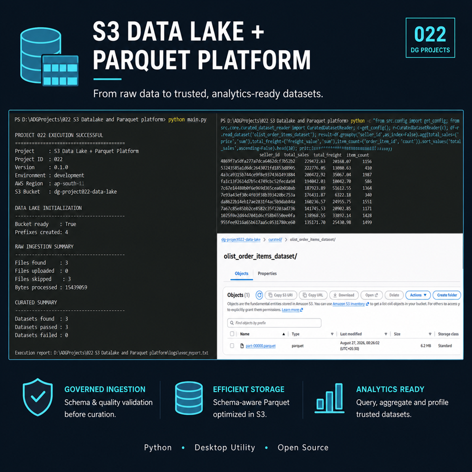

# 2. Project Badges

 


# 3. Screenshots

  --------------------------------------------------------------------------------------------------------------------
  Screenshot                                                                       Description
  -------------------------------------------------------------------------------- -----------------------------------
  [Ingestion Result](screenshots/ingestion-result-output.PNG)                      End-to-end ingestion and curated
                                                                                   pipeline execution result.

  [Parquet File Size](screenshots/paraquet-file-size-confirmation.PNG)             Local Parquet output size
                                                                                   confirmation.

  [Parquet in S3](screenshots/paraquet-file-visible-in-s3.PNG)                     Curated Parquet dataset visible in
                                                                                   Amazon S3.

  [Parquet                                                                         Top-10 seller analysis executed by
  Analytics](screenshots/generating-top10-sales-using-paraquet-file-reading.PNG)   reading the curated Parquet
                                                                                   dataset.
  --------------------------------------------------------------------------------------------------------------------

# 4. Project Title

# S3 Data Lake + Parquet Platform

# 5. Project Overview

Project 022 implements an S3-based data lake workflow for ingesting
supported source datasets, applying dataset definitions and schema
validation, converting validated data into Parquet, storing curated
datasets in S3, and reading, querying, aggregating, profiling,
validating, and reporting on the curated data.

Typical use cases include:

-   Ingesting CSV, JSON, and JSONL datasets.
-   Applying predefined dataset schemas and processing rules.
-   Converting structured datasets to Parquet.
-   Creating partitioned Parquet datasets where configured.
-   Storing curated datasets in Amazon S3.
-   Reading curated Parquet data for downstream analytics.
-   Running dataset quality, metadata, lineage, and execution reporting.

# 6. Features

-   S3 data lake initialization.
-   Raw dataset ingestion with duplicate/skip handling.
-   Dataset-specific source-format validation.
-   Dataset definition and schema governance.
-   DataFrame-based source loading.
-   Schema validation before Parquet generation.
-   Non-partitioned Parquet dataset generation.
-   Partitioned Parquet dataset generation.
-   Parquet validation after generation.
-   Curated dataset upload and S3 verification.
-   Curated Parquet dataset reading.
-   Dataset querying and aggregation.
-   Dataset statistics and profiling.
-   Dataset metadata and lineage reporting.
-   Dataset quality execution and reporting.
-   End-to-end execution reporting.

# 7. Technology Stack

  Technology          Purpose
  ------------------- ------------------------------------------
  Python              Application implementation
  pandas              DataFrame loading and data processing
  PyArrow / Parquet   Columnar dataset generation and reading
  boto3 / Amazon S3   Data lake storage and S3 integration
  pytest              Automated testing
  PyInstaller         Executable build workflow
  Git / GitHub        Source control and repository management

# 8. Project Structure

``` text
022 S3 Datalake and Paraquet platform/
├── .github/
├── .gitignore
├── .vscode/
├── assets/
│   ├── fonts/
│   ├── icons/
│   ├── images/
│   └── templates/
├── data/
│   ├── curated/
│   ├── curated_test/
│   ├── demo_split/
│   ├── input/
│   ├── output/
│   └── samples/
├── docs/
│   └── UserGuide.md
├── logs/
├── releases/
│   ├── latest/
│   ├── v1.0/
│   └── v1.1/
├── screenshots/
│   ├── generating-top10-sales-using-paraquet-file-reading.PNG
│   ├── ingestion-result-output.PNG
│   ├── paraquet-file-size-confirmation.PNG
│   ├── paraquet-file-visible-in-s3.PNG
│   └── poster.png
├── src/
│   ├── config.py
│   ├── config/
│   │   └── dataset_definitions.py
│   ├── core/
│   │   ├── curated_dataset_aggregation_service.py
│   │   ├── curated_dataset_consumer.py
│   │   ├── curated_dataset_manager.py
│   │   ├── curated_dataset_query_service.py
│   │   ├── curated_dataset_reader.py
│   │   ├── curated_dataset_service.py
│   │   ├── curated_dataset_statistics_service.py
│   │   ├── curated_dataset_validation_service.py
│   │   ├── curated_dataset_validator.py
│   │   ├── curated_data_processor.py
│   │   ├── curated_pipeline.py
│   │   ├── curated_pipeline_runner.py
│   │   ├── dataset_quality_runner.py
│   │   ├── data_lake_manager.py
│   │   ├── parquet_dataset_processor.py
│   │   └── raw_data_ingestor.py
│   ├── dataset_config/
│   │   ├── dataset_definitions.py
│   │   └── __init__.py
│   ├── models/
│   ├── services/
│   │   ├── curated_dataset_metadata_service.py
│   │   ├── curated_dataset_validation_service.py
│   │   ├── curated_pipeline_report_service.py
│   │   ├── dataframe_service.py
│   │   ├── dataset_definition_service.py
│   │   ├── dataset_lineage_service.py
│   │   ├── dataset_quality_execution_report.py
│   │   ├── dataset_quality_orchestrator.py
│   │   ├── dataset_quality_report_service.py
│   │   ├── dataset_quality_service.py
│   │   ├── dataset_schema_registry.py
│   │   ├── execution_report_service.py
│   │   ├── parquet_service.py
│   │   ├── partition_service.py
│   │   ├── s3_service.py
│   │   └── schema_service.py
│   ├── ui/
│   └── utils/
├── tests/
├── LICENSE
├── main.py
├── pyproject.toml
├── README.md
└── requirements.txt
```

# 9. Module Overview

  -----------------------------------------------------------------------
  **Module**                          **Responsibility**
  ----------------------------------- -----------------------------------
  `main.py`                           Application entry point and
                                      end-to-end execution orchestration.

  `src/core/`                         Core data-lake, curated-data,
                                      Parquet, ingestion, pipeline, and
                                      quality-processing workflows.

  `src/services/`                     Reusable services for data loading,
                                      schemas, S3, Parquet, partitions,
                                      metadata, lineage, quality, and
                                      reporting.

  `src/dataset_config/`               Dataset definitions and
                                      dataset-specific processing rules.

  `src/config.py`                     Application configuration and
                                      runtime settings.

  `tests/`                            Slice-level automated tests for
                                      core and service components.

  `docs/`                             User-facing project documentation.

  `data/`                             Local input, curated, test, demo,
                                      output, and sample data areas.

  `screenshots/`                      Demonstration screenshots and
                                      project poster.

  `releases/`                         Release artifacts and release
                                      directories.
  -----------------------------------------------------------------------

# 10. Source Code Overview

  ------------------------------------------------------------------------------------------------------------
  **Source File**                                              **Purpose**             **Dependencies**
  ------------------------------------------------------------ ----------------------- -----------------------
  `main.py`                                                    Entry point for the     `src.config`, core
                                                               Project 022 end-to-end  pipeline/manager
                                                               execution. Initializes  classes, reporting
                                                               the workflow and        services
                                                               produces the execution  
                                                               result.                 

  `src/config.py`                                              Defines application     Python standard library
                                                               configuration and       
                                                               runtime paths, S3       
                                                               settings, and           
                                                               processing              
                                                               configuration.          

  `src/dataset_config/dataset_definitions.py`                  Defines supported       Python standard library
                                                               datasets, source        
                                                               formats, expected       
                                                               schemas, and partition  
                                                               configuration.          

  `src/dataset_config/__init__.py`                             Package initialization  None
                                                               for dataset             
                                                               configuration.          

  `src/core/data_lake_manager.py`                              Initializes and manages `boto3` / S3 service
                                                               the S3 data-lake        
                                                               structure and required  
                                                               prefixes.               

  `src/core/raw_data_ingestor.py`                              Discovers source files  `boto3`, `pathlib`
                                                               and manages raw-file    
                                                               ingestion into the data 
                                                               lake.                   

  `src/core/curated_pipeline.py`                               Executes the main       `pandas`, `pyarrow`,
                                                               curated flow from       internal services
                                                               source loading through  
                                                               schema validation,      
                                                               Parquet generation, S3  
                                                               upload, and             
                                                               verification.           

  `src/core/curated_pipeline_runner.py`                        Runs the curated        Internal curated
                                                               pipeline across         pipeline/reporting
                                                               discovered datasets and modules
                                                               aggregates              
                                                               dataset-level results.  

  `src/core/curated_data_processor.py`                         Coordinates processing  `pandas`, internal
                                                               of source data into     dataset/schema services
                                                               curated datasets.       

  `src/core/parquet_dataset_processor.py`                      Generates and validates `pandas`, `pyarrow`
                                                               Parquet datasets,       
                                                               including partitioned   
                                                               datasets.               

  `src/core/curated_dataset_manager.py`                        Manages curated         `boto3`, internal S3
                                                               datasets and their S3   service
                                                               storage operations.     

  `src/core/curated_dataset_service.py`                        Provides                `pandas`, internal
                                                               curated-dataset         services
                                                               processing operations   
                                                               used by higher-level    
                                                               workflows.              

  `src/core/curated_dataset_reader.py`                         Reads curated Parquet   `pandas`, `pyarrow`,
                                                               datasets for downstream internal S3 service
                                                               processing and          
                                                               analysis.               

  `src/core/curated_dataset_query_service.py`                  Provides query-oriented `pandas`
                                                               operations over curated 
                                                               datasets.               

  `src/core/curated_dataset_aggregation_service.py`            Performs aggregation    `pandas`
                                                               operations over curated 
                                                               datasets.               

  `src/core/curated_dataset_statistics_service.py`             Calculates dataset      `pandas`
                                                               statistics and          
                                                               profiling information.  

  `src/core/curated_dataset_validation_service.py`             Coordinates validation  `pandas`, internal
                                                               of curated dataset      validation services
                                                               outputs.                

  `src/core/curated_dataset_validator.py`                      Validates curated       `pandas`, `pyarrow`
                                                               dataset contents and    
                                                               processing results.     

  `src/core/dataset_quality_runner.py`                         Runs dataset quality    Internal quality
                                                               processing and          services
                                                               coordinates quality     
                                                               results.                

  `src/services/dataframe_service.py`                          Loads supported CSV,    `pandas`, `pathlib`
                                                               JSON, and JSONL files   
                                                               into pandas DataFrames  
                                                               and provides basic      
                                                               DataFrame metadata.     

  `src/services/schema_service.py`                             Validates source        `pandas`
                                                               DataFrame schemas       
                                                               against expected        
                                                               dataset definitions.    

  `src/services/dataset_definition_service.py`                 Provides controlled     Internal dataset
                                                               access to dataset       configuration
                                                               definitions, supported  
                                                               formats, schemas, and   
                                                               partition               
                                                               configuration.          

  `src/services/s3_service.py`                                 Provides reusable       `boto3`
                                                               Amazon S3 operations    
                                                               used by the data lake   
                                                               and curated workflows.  

  `src/services/parquet_service.py`                            Provides                `pyarrow`, `pandas`
                                                               Parquet-related service 
                                                               operations.             

  `src/services/partition_service.py`                          Provides                `pandas`, `pyarrow`
                                                               partition-related       
                                                               dataset operations.     

  `src/services/curated_dataset_metadata_service.py`           Produces metadata for   `pandas`, internal
                                                               curated datasets.       curated services

  `src/services/dataset_lineage_service.py`                    Provides lineage        Internal
                                                               information connecting  pipeline/services
                                                               source and curated      
                                                               dataset processing.     

  `src/services/curated_dataset_validation_service.py`         Provides service-level  `pandas`, `pyarrow`
                                                               curated dataset         
                                                               validation              
                                                               functionality.          

  `src/services/curated_pipeline_report_service.py`            Builds reporting        Internal pipeline
                                                               information for curated services
                                                               pipeline execution.     

  `src/services/execution_report_service.py`                   Generates the overall   Python standard library
                                                               project execution       
                                                               report.                 

  `src/services/dataset_quality_service.py`                    Performs dataset        `pandas`
                                                               quality checks and      
                                                               returns quality         
                                                               results.                

  `src/services/dataset_quality_orchestrator.py`               Coordinates the         Internal quality
                                                               execution of dataset    services
                                                               quality checks.         

  `src/services/dataset_quality_execution_report.py`           Represents              Python standard library
                                                               dataset-quality         
                                                               execution results.      

  `src/services/dataset_quality_report_service.py`             Formats and manages     Internal quality
                                                               dataset quality         services
                                                               reporting.              

  `src/services/dataset_schema_registry.py`                    Provides                Internal dataset
                                                               schema-registry         configuration
                                                               functionality for       
                                                               configured dataset      
                                                               schemas.                

  `tests/test_slice2_curated_s3.py`                            Tests curated S3        `pytest`, project S3
                                                               dataset operations      modules
                                                               introduced in Slice 2.  

  `tests/test_slice2_execution_reporting.py`                   Tests                   `pytest`, project
                                                               execution-reporting     reporting modules
                                                               behavior introduced in  
                                                               Slice 2.                

  `tests/test_slice2_parquet.py`                               Tests Parquet           `pytest`, `pyarrow`
                                                               generation and          
                                                               validation behavior     
                                                               introduced in Slice 2.  

  `tests/test_slice2_pipeline_runner.py`                       Tests Slice 2 curated   `pytest`, project
                                                               pipeline runner         pipeline modules
                                                               behavior.               

  `tests/test_slice3_curated_dataset_aggregation_service.py`   Tests curated dataset   `pytest`, `pandas`
                                                               aggregation             
                                                               functionality.          

  `tests/test_slice3_curated_dataset_consumer.py`              Tests curated dataset   `pytest`, project
                                                               consumer behavior.      curated-data modules

  `tests/test_slice3_curated_dataset_query_service.py`         Tests curated dataset   `pytest`, `pandas`
                                                               query operations.       

  `tests/test_slice3_curated_dataset_reader.py`                Tests reading curated   `pytest`, `pandas`,
                                                               datasets.               `pyarrow`

  `tests/test_slice3_curated_dataset_service.py`               Tests curated dataset   `pytest`, project
                                                               service behavior.       curated-data modules

  `tests/test_slice3_curated_dataset_statistics_service.py`    Tests curated dataset   `pytest`, `pandas`
                                                               statistics and          
                                                               profiling               
                                                               functionality.          

  `tests/test_slice3_curated_dataset_validation.py`            Tests curated dataset   `pytest`, project
                                                               validation behavior.    validation modules

  `tests/test_slice3_curated_dataset_validator.py`             Tests curated dataset   `pytest`, `pandas`,
                                                               validator behavior.     `pyarrow`

  `tests/test_slice4_curated_dataset_metadata.py`              Tests curated dataset   `pytest`, project
                                                               metadata functionality. metadata services

  `tests/test_slice4_dataset_lineage_service.py`               Tests dataset lineage   `pytest`, project
                                                               functionality.          lineage services

  `tests/test_slice4_dataset_quality_execution_report.py`      Tests dataset quality   `pytest`
                                                               execution-report        
                                                               structures.             

  `tests/test_slice4_dataset_quality_runner.py`                Tests dataset quality   `pytest`, project
                                                               runner behavior.        quality modules

  `tests/test_slice4_dataset_quality_service.py`               Tests dataset quality   `pytest`, `pandas`
                                                               service behavior.       

  `tests/test_slice4_dataset_schema_registry.py`               Tests dataset schema    `pytest`, project
                                                               registry behavior.      schema modules

  `tests/test_slice4_dataset_quality_orchestrator.py`          Tests dataset quality   `pytest`, project
                                                               orchestration.          quality modules

  `tests/test_slice4_dataset_quality_report_service.py`        Tests dataset quality   `pytest`, project
                                                               report generation.      quality modules
  ------------------------------------------------------------------------------------------------------------

# 11. How to Run

## Prerequisites

-   Python installed and available on the command line.
-   Project dependencies installed from `requirements.txt`.
-   AWS credentials configured with access to the target S3 bucket.
-   An S3 bucket name and AWS region configured for the project.

## Install Dependencies

``` powershell
pip install -r requirements.txt
```

## Configure Runtime

For the demonstrated AWS environment:

``` powershell
$env:PROJECT022_S3_BUCKET="dg-project022-data-lake"
$env:AWS_REGION="ap-south-1"
```

## Run the Application

From the project root:

``` powershell
python main.py
```

The program initializes the data lake, processes supported input
datasets, creates or validates curated Parquet datasets, performs S3
verification, and writes an execution report under `logs/`.

# 12. How to Build

The repository contains a release/build structure and PyInstaller is
part of the project technology stack.

A typical executable build command is:

``` powershell
pyinstaller --onefile main.py
```

The generated executable is placed under:

``` text
dist/
```

The exact PyInstaller options can be extended if a release build
requires additional assets or packaging configuration.

# 13. Version

  Item              Value
  ----------------- ----------------------------------------------------
  Current Version   `0.1.0`
  Release Date      Not specified in the provided repository structure
  Status            Working / End-to-end demo validated

# 14. Development Workflow

``` text
Requirements
    ↓
Architecture & Dataset Definitions
    ↓
Core / Service Implementation
    ↓
Slice-Level Testing
    ↓
End-to-End Integration
    ↓
S3 + Parquet Validation
    ↓
Analytics / Reader Validation
    ↓
Execution Reporting
    ↓
Executable Build
    ↓
GitHub Release
```

# 15. License

This project includes a `LICENSE` file at the repository root.

**License:** See [`LICENSE`](LICENSE) for the applicable license terms.
